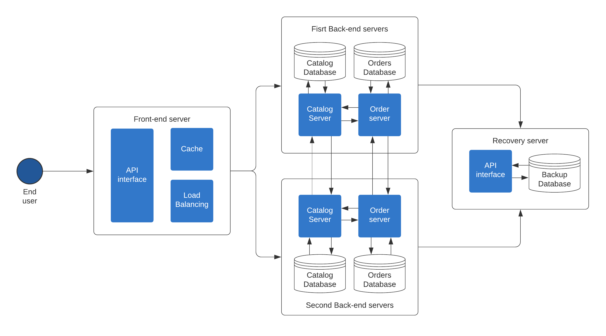
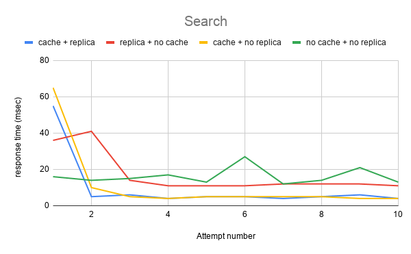
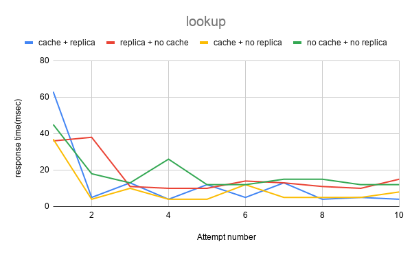
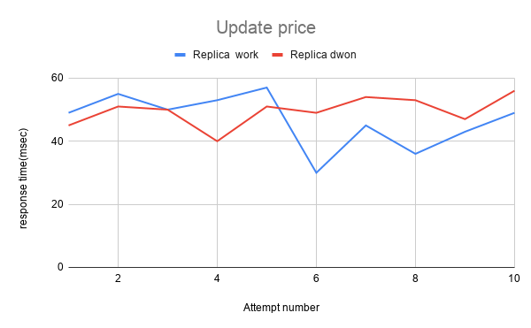
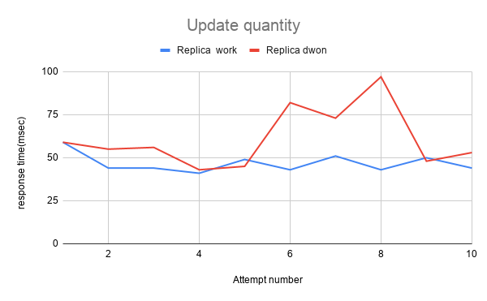
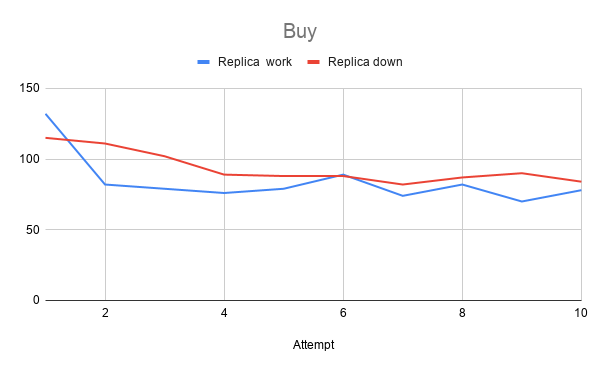

# Bazar

Bazar, it's a simple store based on a multi-tier architecture implemented using microservices, making it divided into two main parts: front-end side and back-end side. Bazar project aims to apply a set of basic concepts in distributed systems of replication, consistency, and caching.

# Architecture

Bazar relies on microservices in its construction, as it is divided into several parts, each part aims to perform a specific function, and these parts collaborate to perform the required tasks.

The microservices that are primarily Bazar are front-end servers and back-end servers.
The front-end is responsible for providing services to the end-users. It also contains a cache of information about books in Bazar and is responsible for load balancing of requests on back-end microservices. The back-end is divided into many microservices. There are Catalog microservices are responsible for displaying, storing, and updating information books in Bazar. In addition to Order microservices are responsible for providing selling services to customers. These servers communicate with each other to ensure consistency between them, and in the event that there is a defect in one of them, the recovery server is found to store modifications until the other servers return to work.

The following photo illustrates Bazar's architecture composed of front-end, Catalog, Order, and recovery microservices.


Bazar built microservices using **Flask** a micro web framework written in **Python**. Flask provides easy, simple, and fast **RESTful API** building. **SQLite** Database was also used to store books, their details, and Orders. And in dealing with databases with an object-relational mapper **SQL Alchemy**, and **Marshmallow** was used.

# Installation

Bazar is currently distributed into six microservices, each one found in a separate folder. Each of these folders, except front-end and recovery, contains a server_configuration.py file that contains the URL of the other servers. to run them you must modify them to suit your machine's environment. After modifying them, the following steps should be followed:

- install Python and pip:

```
$ sudo apt install python3
$ sudo apt install python3-pip
```

- for each server ensure the requirements python libraries was installed

```
$ pip3 install -r requirements.txt
```

- Finally, you can run servers using the following comands:

```
$ python3 '.\front-end server\front-end server.py'
$ python3 '.\catalog server\server_configuration.py'
$ python3 '.\order server\order_server.py'
$ python3 '.\second catalog server\catalog_server.py'
$ python3 '.\second order server\order_server.py'
$ python3 .\recovery_server\recovery_server.py
```

# Microservices

## Front-End

The front-end is responsible for receiving requests from the end-user and directing them to their responsible servers, And because there is more than one server performing the same tasks, the front-end worked to distribute the tasks between them so that the work balance between them as much as possible. As the front-end distributes the incoming tasks on the servers one by one sequentially, and if it finds one of the servers down, it tries to send it to another server that performs the same functionality. Moreover, the front-end contains a cache cached incoming response that comes from the catalog servers.

### The API

The front-end server offers many requests that may be received via the end-user or through back-end servers. RESTfull API was adopted in its construction as in the rest of Bazar, and the following table shows the request that reaches the front-end
| Operation | Method | Route | Body request | Response | Sender (end-user/ back-end) |
|-----------------|--------|------------------------|------------------------|---------------------------------------------------------------------------------------------------------------------------------------------------------------|-----------------------------|
| search | GET | /search/<string:topic> | `empty` | `200`, return an array under this topic each element contents book id and title, otherwise `404` when no book under this topic | end-user |
| lookup | GET | /lookup/<int:id> | `empty` | `200` if the book exist return more information about the book (title, quantity, and cost) otherwise it return `404` indicates that there is no book with this id | end-user |
| update price | PUT | /update/price/<int:id> | `{ "price" : 900 }` | `200` if the changes happened correctly and the price updated, 400 if the request bad and cant handle it, or `404` if there is no book with this id | end-user |
| update quantity | PUT | /update/item/<int:id> | `{ "quantity" : 900 }` | `200` if the changes happened correctly and the quantity updated, `400` if the request bad and cant handle it, or `404` if there is no book with this id | end-user |
| buy | PUT | /buy/<int:id> | `empty` | `201` if the purchase process done and stored inside the order database, otherwise it will return `404` to indicate that the book out of stock or does not exist | end-user |
| invalidate | DELETE | /invalidate/<int:id> | `empty` | `200` when the item removed from the cache | back-end |

## Catlaog

The goal of the catalog microservices is to store and display the book's information in Bazar using the RESTful API. Books and their information are stored in the SQLite database. Requests arrive from either the front-end or the order. And it responds directly to them with reading events after making sure that the stored data did not have any amendments on it. on the other hand, when modification happened, the catalog tries to communicate with the rest of the catalogs to inform them. If the communication with one of the servers fails, the catalog communicates with the recovery server to store the update, and whoever did not receive the update.

### API

| operation               | method | route                  | request body                                                                    | response                                                                                                                                                                                                                                                            | sender server   |
| ----------------------- | ------ | ---------------------- | ------------------------------------------------------------------------------- | ------------------------------------------------------------------------------------------------------------------------------------------------------------------------------------------------------------------------------------------------------------------- | --------------- |
| search                  | GET    | /search/               | `empty`                                                                         | `200`, return an array under this topic each element contents book id and title, otherwise `410`when no book under this tpoic                                                                                                                                       | front-end       |
| lookup                  | GET    | /lookup/               | `empty`                                                                         | `200` if the book exist return more information about the book (title, quantity, and cost) otherwise it return `404` indicates that there is no book with this id                                                                                                   | front-end       |
| update price            | PUT    | /update/price/         | `{ "price" : 900 }`                                                             | `200` if the changes happened correctly and the price updated, `400` if the request bad and cant handle it, or `404` if there is no book with this id                                                                                                               | front-end       |
| update quantity         | PUT    | /update/item/          | `{ "quantity" : 900 }`                                                          | `200` if the changes happened correctly and the quantity updated, `400` if the request bad and cant handle it, or `404` if there is no book with this id                                                                                                            | front-end       |
| check the book quantity | GET    | /verify_item_in_stock/ | `empty`                                                                         | `200` if book the book available and its return book id and quantity, `410` if this book is being sold in this store but is not available right now out, `404` if this book is not being sold here                                                                  | order           |
| buy                     | PUT    | /buy/                  | `empty`                                                                         | `204` if the purchase process done at the catalog side and the catalog database updated, `410` if this book is being sold in this store but is not available right now out, otherwise it will return `404` to indicate that the book out of stock or does not exist | order           |
| sync                    | PUT    | /sync                  | `{ "id": 1, "title": "spring", "quantity": 12, "cost": 10, "topic": "spring" }` | `200` if the catalog database updated, otherwise if the server can not handle it `400` will returned                                                                                                                                                                | another catalog |
|                         |        |                        |                                                                                 |                                                                                                                                                                                                                                                                     |                 |

## Order

The purpose of order microservices is to complete the purchase process and store it in its database. The order communicates with the catalog to verify that there are sufficient quantities of the book to complete the purchase and communicates with other order servers to ensure consistency between them. In cases of failure of one of them, it stores the data on the recovery server as the catalog server does. Also, when the order server returns to work it communicate with the recovery server it guarantees consistency.

### API

Requests to order arrive either from the front-end or another order server to achieve consistancy. The following two tables list the requests arriving to the order server.

#### Buy Request

| route         | status code | message body                                                           | description                                                                                            |
| ------------- | ----------- | ---------------------------------------------------------------------- | ------------------------------------------------------------------------------------------------------ |
| /buy/<int:id> | 201         | return json object contanes the order id and the book id               | The purchase was successfully completed and stored in the database                                     |
| /buy/<int:id> | 410         | return a message says: "This book is currently unavailable"            | the book out of stock                                                                                  |
| /buy/<int:id> | 530         | return a message says: "The server is not ready to handle the request" | due to an error of the connection between two back-end servers the order server cant handle th request |

#### Sync Request

| Route | Method | Status Code | Description                                                                           |
| ----- | ------ | ----------- | ------------------------------------------------------------------------------------- |
| /sync | PUT    | `200`       | the order server handle the request                                                   |
| /sync | PUT    | `400`       | the server cannot process the request due to something perceived to be a client error |

## Recovery

The recovery server aims to store the updates that occur on the data if one of the servers fails, and it saves this data until the server returns to work and requests it from it.

### API

the following table illustrates the recovery server API:

| operation        | method | route       | response                                                            | sender server |
| ---------------- | ------ | ----------- | ------------------------------------------------------------------- | ------------- |
| Add book update  | POST   | /addBook    | `201`, when the book updates store to the database, otherwise `405` | front-end     |
| Add order        | POST   | /addOrder   | `201`, when the order store to the database, otherwise `405`        | front-end     |
| Get books update | GET    | /getUpdates | `200` and the body content books                                    | front-end     |
| Get orders       | GET    | /getOrder   | `200` and the body content orders                                   | front-end     |

# Performance

Operations in Bazar can be divided into three main types: get information, update, and buy. Each of them varies on the time taken to get a response. In the following, the performance will be compared for each of these operations in the case of the cache is working or not, and the replica fails or working fine.

## Get infromation

there is two type of geting information, search and lookup. Both of them showed average response time close to each other in the four cases. The following table shows average response time in millisecond.

| Operation | cache and replica | replica and no cache | cache and no replica | no cache and no replica |
| --------- | ----------------- | -------------------- | -------------------- | ----------------------- |
| Search    | 9.9               | 17.1                 | 11.2                 | 16.2                    |
| Lookup    | 12.8              | 16.8                 | 9.4                  | 18                      |

The effect of cache on response time is shown as the average time decreased by 42.1% in the search operation and 23.8% in the lookup operation. The following pictures show the responce time for each request.
|  |  |
|---|---|

## Update

The update operation is divided into two operations, quantity or price update of the books in Bazar. In the next table, the response rate for the two processes is shown if a replica is working or failing. As it demonstrates an increase in the response time compared to search or lookup operations. The reason that the catalog server sends an invalidation message to the front-end to remove the book from the cache. Moreover, that Bazar maintains consistency by sending these modifications to the rest of the replicas, and if communication with them fails, it sends these changes to a recovery point so that the catalog server will restore them when it returns for work.

| Operation       | Replica work | Replica down |
| --------------- | ------------ | ------------ |
| Update price    | 46.7         | 49.6         |
| Update quantity | 46.8         | 61.1         |

The following pictures show the responce time for each request

The following pictures show the responce time for each request
|  |  |
|---|---|

## Buy

The buying process is the most time-consuming in Bazar, reason is that the order server connects to the catalog server to verify the existence of a book and complete the update of the database, then complete the purchase process after communicating with the rest of the order servers. Which makes it the longest response time, as shown in the following table and image.

| Operation | Replica work | Replica down |
| --------- | ------------ | ------------ |
| Buy       | 84.1         | 93.6         |



In the three basic operations, a high response time appears in the first request, due to the cold start, as the server checks the validity of the data in the database when the first request reaches the server.

# RESTful Output

## front-end server:

- Search Output

  - there is books under this topic:

    request: `GET http://fron-end server/search/distributed systems`

    response status: `200 ok`

    response body:

    ```
    [
        {
            "cost": 854.0,
            "id": 1,
            "quantity": 175770,
            "title": "How to get a good grade in DOS in 20 minutes a day",
            "topic": "distributed systems"
        },
        {
            "cost": 326.0,
            "id": 2,
            "quantity": 121,
            "title": "RPCs for Dummies",
            "topic": "distributed systems"
        }
    ]

    ```

  - No books under this topic:

    request: `GET http://fron-end server/search/network`

    response status: `404 NOT FOUND`

    response body:

    ```
    {
        "message": "There are no books under this topic"
    }
    ```

- Lookup output

  - there is book with this ID:

    request: `GET http://fron-end server/lookup/1`

    response status: `200 ok`

    response body:

    ```
    {
        "cost": 854.0,
        "id": 1,
        "quantity": 175770,
        "title": "How to get a good grade in DOS in 20 minutes a day",
        "topic": "distributed systems"
    }
    ```

  - No book with this ID:

    request: `GET http://fron-end server/lookup/90`

    response status: `404 NOT FOUND`

    response body:

    ```
    {
        "message": "There is no book with this ID"
    }
    ```

- Update price output

  - there is a book with this ID:

    request: `PUT http://fron-end server/price/1`

    request body:

    ```
    {
        "price" : 900
    }
    ```

    response status: `200 ok`

    response body:

    ```
    {
        "cost": 900.0,
        "id": 1,
        "quantity": 175770,
        "title": "How to get a good grade in DOS in 20 minutes a day",
        "topic": "distributed systems"
    }
    ```

  - bad body request :

    request: `PUT http://fron-end server/update/price/1`

    request body:

    ```
    {
        "gool" : 900
    }
    ```

    response status: `400 BAD REQUEST`

    response body:

    ```
    {
        "message": "bad request can not handle the request due to invaled data"
    }
    ```

  - there is no book with this ID:

    request: `PUT http://fron-end server/update/price/90`

    request body:

    ```
    {
        "price" : 900
    }
    ```

    response status: `404 NOT FOUND`

    response body:

    ```
    {
        "message": "There is no book with this ID"
    }
    ```

- Update quantity output

  - there is book with this ID:

    request: `PUT http://fron-end server/update/item/1`

    request body:

    ```
    {
        "quantity" : 600
    }
    ```

    response status: `200 ok`

    response body:

    ```
    {
        "cost": 900.0,
        "id": 1,
        "quantity": 600,
        "title": "How to get a good grade in DOS in 20 minutes a day",
        "topic": "distributed systems"
    }
    ```

  - bad body request:

    request: `PUT http://fron-end server/update/item/1`

    request body:

    ```
    {
        "gool" : 900
    }
    ```

    response status: `400 BAD REQUEST`

    response body:

    ```
    {
        "message": "bad request can not handle the request due to invaled data"
    }
    ```

  - there is no book with this ID:

    request: `PUT http://fron-end server/update/item/10`

    request body:

    ```
    {
        "quantity" : 900
    }
    ```

    response status: `404 NOT FOUND`

    response body:

    ```
    {
        "message": "There is no book with this ID"
    }
    ```

- Buy output

  - there is book with this ID:

        request: `PUT http://fron-end server/buy/1`

        response status: `201 CREATED`

        response body:

        ```
        {
            "book_id": 1,
            "order_id": 2
        }
        ```

  - the book out of stock :

    request: `PUT http://fron-end server/buy/2`

    response status: `401 GONE`

    response body:

    ```
    {
        "message": "This book is currently unavailable"
    }
    ```

  - there is no book with this ID:

    request: `PUT http://fron-end server/buy/10`

    response status: `404 NOT FOUND`

    response body:

    ```
    {
        "message": "This book unavailable"
    }
    ```

## order server:

- The output of the buy process from the order side veiw

  - there are book with this ID:

        request: `PUT http://order server/buy/3`

        response status: `201 CREATED`

        response body:

        ```
        {
            "book_id": 3,
            "order_id": 4
        }
        ```

  - there is book with this ID but not avaiable at the stock :

    request: `PUT http://fron-end server/update/item/2`

    response status: `401 GONE`

    response body:

    ```
    {
        "message": "This book is currently unavailable"
    }
    ```

  - there is no book with this ID:

    request: `PUT http://fron-end server/update/item/80`

    response status: `404 NOT FOUND`

    response body:

    ```
    {
        "message": "This book unavailable"
    }
    ```

## catalog server:

- Search, lookup, buy, update price, and update quntity replies are the same as in order and front-end server.
- check the book quantity:

  - there are book with this ID:

    request: `GET http://catalog server/verify_item_in_stock/3`

    response status: `200 ok`

    response body:

    ```
    {
    "id": 3,
    "quantity": 79
    }
    ```

    - there is no book with this ID:

    request: `GET http://catalog server/verify_item_in_stock/70`

    response status: `404 NOT FOUND`

    response body:

    ```
    {
    "message": "There is no book with this ID"
    }
    ```

    - there is book with this ID but out of stok:

    request: `GET http://catalog server/verify_item_in_stock/2`

    response status: `410 GONE`

    response body:

    ```
    {
    "message": "This book is currently unavailable"
    }
    ```
